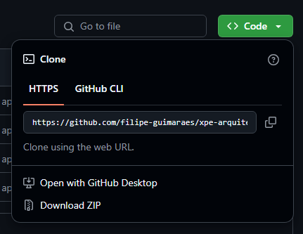
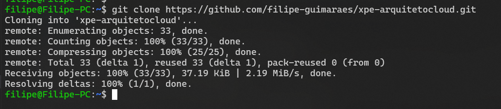
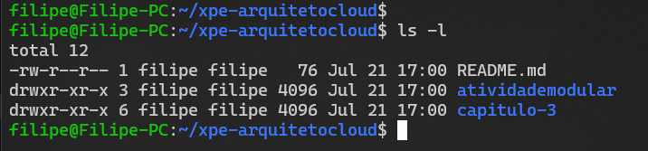

# Atividade Modular - Terraform com AWS na prática

### Clone do repositório

1. Esse é um repositório publico, portanto, vocês vão conseguir executar um git clone desse repositório em seu terminal normalmente, sme a necessidade de permissões adicionais!
   a. Copie a URL HTTPS publica desse repositório:
  
  

  b.No seu terminal local, execute o comando: `git clone https://github.com/filipe-guimaraes/xpe-arquitetocloud.git`

  

  c. Após isso, o repositório estará clonado em seu terminal local:

  

### Processo de instalação do Terraform - v1.10.5

Após clonar o projeto em seu terminal local, voc6e verá um script chamado ins tall_terraform.sh contido na raiz desse repositorio. Siga os passos abaixo para completar a instalação do terraform:

- Atribuir permissão de execução para o script: chmod +x install_terraform.sh
- Executar o script: ./install_terraform.sh
- O resultado final do script deve ser como abaixo:

