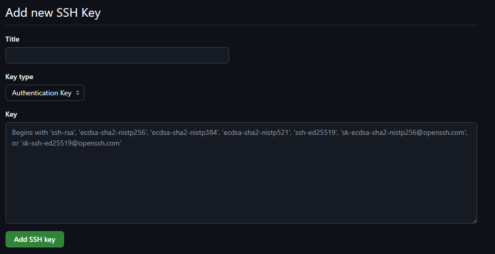

# Atividade Modular - Terraform com AWS na prática

### Processo de instalação do Terraform - v1.10.5

Para instalar o terraform, execute o script install_teraform.sh contido nesse repositório, de acordo com os passos abaixo:

- Atribuir permissão de execução para o script: chmod +x install_terraform.sh
- Executar o script: ./install_terraform.sh
- O resultado final do script deve ser como abaixo:

Para clonar o repositorio do github que contem o projeto, siga os passos abaixo:

1. Gere uma chave no seu terminal com o comando:
- `ssh-keygen -t ed25519 -C "seu-email@exemplo.com" -f ~/.ssh/nomedasuachave`
2. Adicione a chave gerada ao ssh-agent:
- `eval "$(ssh-agent -s)"`
- `ssh-add ~/.ssh/nomedasuachave`

3. Agora você precisa adicionar o conteudo da chave publica no seu github para conseguir clonar o repositorio

4. Após isso, basta executar o seguinte comando em seu terminal:

- `git clone git@github.com:filipe-guimaraes/atividademodular-xpe.git` #Substitua aqui pelo endereço do seu repositório

5. Após isso o repositório está clonado no seu terminal e você pode acessar o diretório para iniciar a prática